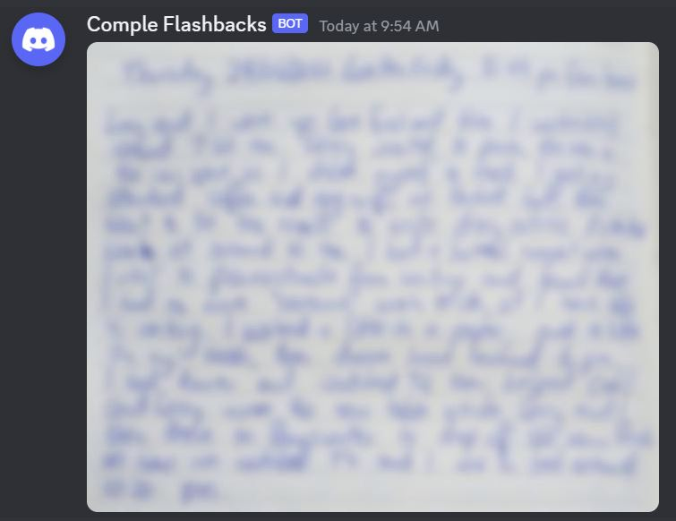

# comple-flashbacks

A service to send me notifications about what I did on this day in years past.

For several years I have been writing handwritten descriptions of what I get up to each day. The idea is to keep track of my day to day activities, not just bigger events in my life. On any day, I can look back and see what I did on that date in previous years.

## Part 1: Basic version
### Digitising
I need to make digital copies of the diary entries. Typing up years of handwritten entries would be too tedious and time consuming. So instead, I take scans of each diary entry. An example (blurred to hide details) is shown below.

Next I crop and label each image using the date the entry corresponds to. For example `20210624.jpg`. If the handwritten entry spans multiple pages, append a letter to each (`20210624A.jpg`, `20210624B.jpg`, etc.).

### Deploying to cloud
This solution is deployed using Google Cloud Platform, orchestrated using Terraform.

1. Create a bucket in GCS.
2. Manually upload the diary entries to the bucket.
3. Deploy a Google Cloud Function that finds the diary entry in the bucket that matches today's date.
4. Create a Cloud Scheduler to trigger a Pub/Sub message once a day. The Pub/Sub then triggers the GCF.

### Notifications
I have set up a Discord channel in a private server to receive the notifications. I create a webhook for this channel and store the webhook in Google Secret Manager. The GCF has access to this and sends the diary image to the channel. For example:

## Part 2: Better version
**Coming soon!**
Receiving the images daily is fine for now, but there is so much more I want to do with this project:
- Handwritten text recognition.
Here I would train a OCR model to learn my handwritting and then convert the digital images to text.
- Analysis of text.
WHat words, phrases do I tend to use? Can I run a sentiment analysis or find trends?
- Train a NLP model on the text.
Can I create a model that talks like me?
